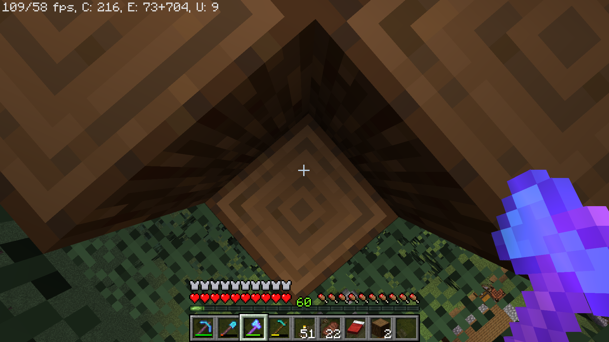
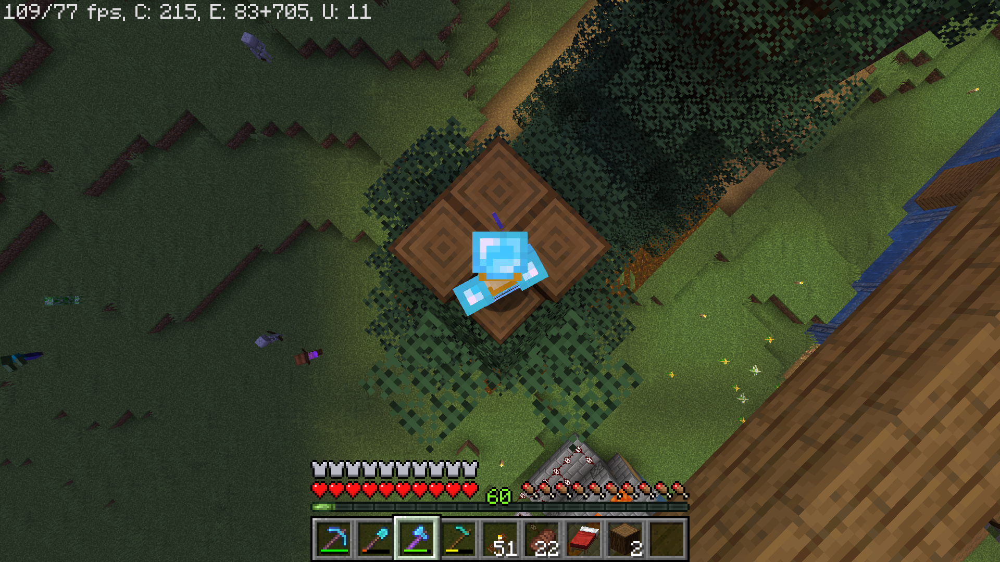
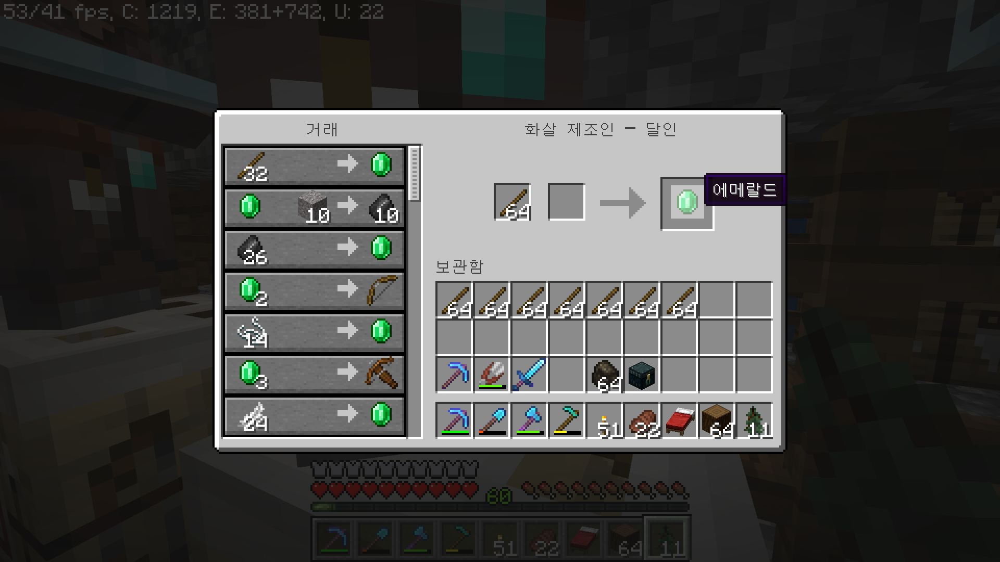

# Minecraft Clicker

Minecraft 플레이시 유용한 AutoHotKey(Legacy) 스크립트입니다.

완성도가 높은 스크립트는 아닙니다. 대충 수정해서 사용하시면 됩니다.

## 기능
- F1: 가문비 나무 원목 1묶음(64개)을 모두 막대기로 제작
- F4: 가문비 나무 (2x2 대형) 반자동 캐기
- F6: 주민에게 아이템 팔기 (Shift 키 누른 상태로 좌클릭, 스페이스 8회 반복, 화살 상인에게 막대기 팔기에 최적화되어있습니다)
- F7: 좌클릭 연타 토글
- F8: 좌클릭 꾹 누른 상태 토글
- F9: 블록 수직 쌓기 (아래를 본 상태에서 스페이스, 우클릭 반복)

## 다운로드
- [mc_clicker.ahk](mc_clicker.ahk)

## 추가 설명
### 가문비 나무
가문비 나무(Spruce Wood)는 묘목을 2x2 크기로 심는 경우 아주 길게 자랍니다. 이를 이용하여 손쉽게 목재를 얻을 수 있으며, 이를 반자동으로 채취한 후 화살 상인에게 판매하여 에메랄드를 얻기 위해 만들어진 스크립트입니다. 

### 나무 반자동 캐기
나무 반자동 캐기 스크립트는 아래와 같이 2개를 채취한 후 아래를 쳐다보며 시작하면 됩니다.

### 주민에게 아이템 팔기
아래와 같이 세팅 후 시작하면 됩니다.

## 테스트 환경

| 항목 | 내용 | 비고 |
| - | - | - |
| AutoHotKey 버전 | 1.1.13.0 | |
| 마인크래프트 버전 | 1.19.2 | |
| 화면 해상도 | 1920x1080 | |
| GUI 비율 | Auto | |
| FOV | 70 (기본값) | |
| 윈도우 마우스 커서 속도 | 정중앙 | |
